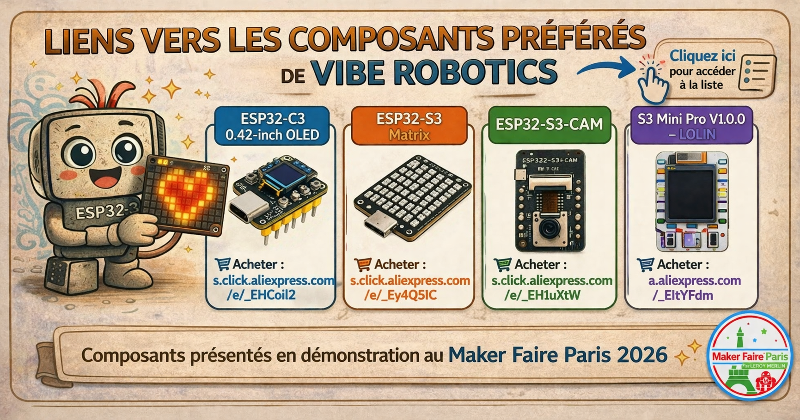
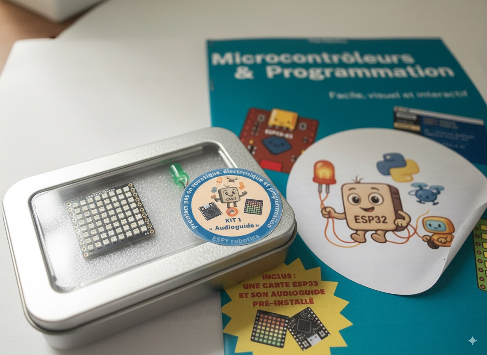

# Vibe-Robotics
> ### 🙌 Merci – Maker Faire 2026  
> ### Merci à toutes celles et ceux qui sont passés au stand **Vibe Robotics** lors de la **Maker Faire 2026** au *Musée des Arts et Métiers* le 11 avril!  Ci-dessous retrouvez les liens cers les composants presents sur le stand.
>  ---
> 
> ---  
>  
> ### 📩 Restons en contact  
>  
> N'hésitez pas à nous envoyer un email si :  
> - avez des questions  
> - avez des suggestions  
> - souhaitez être tenus informés de nos projets   
 
> Nous serons ravis d’échanger avec vous.

<table>
  <tr>
    <td style="padding-right:20px; vertical-align:middle;">

 <h2>💡 Le microcontrôleur ESP32 : idéal pour débutants</h2>
      <b>Bienvenue à <i>ESPY-robotics</i></b>, un projet conçu pour vous familiariser avec l’électronique et la robotique à travers des exemples concrets et des démos interactives.
ESPY-robotics soutient et promeut l’esprit <b>« Vibe Robotics »</b> : une approche progressive, accessible et expérimentale de la robotique   
L’idée est de partir de projets simples, de tester rapidement, puis de prendre le temps de comprendre ce qui fonctionne, pourquoi, et comment aller plus loin.
  

Vous découvrirez la <b>puissance</b> et la <b>versatilité</b> des <b>microcontrôleurs ESP32</b>, associées à la simplicité de <b>CircuitPython</b> et du logiciel <b>Thonny</b>. La démarche <b>« Vibe Robotics »</b>, pendant électronique du « Vibe Coding », est basée sur l'assistance par les <b>LLM (chatGPT, Gemini...)</b>  vise à lever les freins à l’entrée pour les makers amateurs, tout en rappelant que la facilité d’accès ne remplace ni la rigueur ni l’apprentissage auprès de spécialistes. 
L’objectif est d’explorer, d’échanger et d’apprendre ensemble !
    </td>
    <td style="vertical-align:middle;">
      
    </td>
  </tr>
</table>

---

## 🎧 Le kit decouverte "ESPY robotics"

  

[📧 Tenez moi au courant des kits EspY-Robotics](mailto:espy-robotics@protonmail.com?subject=Tenez%20moi%20au%20courant%20des%20kits%20EspY-Robotics&body=%5BMerci%20de%20me%20mettre%20au%20courant.%0ANous%20ne%20transmettrons%20pas%20votre%20adresse%20%C3%A0%20des%20tiers.%5D)

# Guide d'utilisation de la carte ESPY

## Étapes à suivre

1. **Branchement**
   - Branchez la carte **ESPY** (basée sur un microcontrôleur **ESP32**).
   - Suivez les instructions incluses dans le kit.

2. **Lancement de l'audioguide**
   - Lancez l’audioguide pour obtenir des explications **pas à pas**.

3. **Démonstrations**
   Découvrez des démos de programmes :
   - Allumer une **LED**
   - Jouer un **son**
   - Contrôler une **matrice lumineuse**
   - Créer une **petite animation**

4. **Installation et personnalisation**
   - Installez, testez et modifiez vos programmes en utilisant :
     - Les **exemples de code** fournis
     - Le **guide papier** inclus

---

## 🚀 Objectifs 

- Découvrir les bases de l’**électronique** : LEDs, boutons, capteurs...  
- Comprendre les bases de la **programmation** (CircuitPython).  
- S’initier à la **robotique** par de petits projets interactifs.  
- Développer l’esprit **pratique** et **créatif** grâce à des exemples courts.  

---

## 📂 Contenu du kit

Chaque chapitre est composé de :  
- Un **audio** d’explications  
- Un extrait de **script Python**  
- Une **démonstration** (ex. matrice LED...)  

---
## 💡 Exemples de programmes

Une fois l’ESPY branché et l’audioguide lancé, vous pouvez explorer une série de programmes déjà prêts à l’emploi.  
Ils montrent progressivement les possibilités du microcontrôleur ESP32 et servent de base pour vos propres créations.

- **Matrice LED** : animations colorées (arc-en-ciel, plasma, comète, étincelles, ondes, tourbillon) sur l’afficheur 8×8.  
- **Dé électronique** : secouez la carte pour lancer un dé virtuel, avec une animation et un résultat aléatoire de 1 à 6.  
- **Message défilant** : affichez un texte qui défile sur la matrice lumineuse, personnalisable en vitesse et couleur.  
- **Jeux (Snake, Tetris, Pong)** : contrôlez de petits jeux classiques grâce à l’accéléromètre intégré.  
- **Horloge** : connectée au Wi-Fi, elle affiche l’heure locale sur la matrice LED en alternant heures et minutes.  
- **Station météo** : récupère en temps réel la température et l’état du ciel (soleil, pluie, orage) grâce à une API météo.

Ces exemples sont conçus pour être :  
- **visuels**, afin de comprendre immédiatement ce qui se passe,  
- **simples à modifier**, pour que vous puissiez changer un paramètre (couleur, vitesse, texte…) et constater l’effet,  
- **réutilisables**, comme point de départ pour vos propres projets (capteurs, robots, objets connectés…).

👉 Les codes complets et prêts à télécharger se trouvent dans le dossier **exemples** :  
[Exemples — FYCodeLab/espy-robotics](https://github.com/FYCodeLab/espy-robotics/tree/main/exemples)

---

## 📦 Vous souhaitez obtenir un audioguide déjà monté ?
ESPY-robotics promeut l’esprit open-source et encourage chacun à fabriquer lui-même ses systèmes. Les projets présentés s’appuient sur des composants accessibles, des logiciels libres et des documentations ouvertes. Néanmoins, si vous préférez découvrir l'électronique grâce à un kit déjà monté, nous pouvons vous aider.
  
Contactez-nous et nous vous répondrons rapidement.

  <a class="btn"
     href="mailto:espy-robotics@protonmail.com?subject=Demande%20d%E2%80%99informations%20%E2%80%94%20kit%20ESPy%20Robotics&body=Bonjour%2C%0A%0AJe%20souhaite%20des%20informations%20sur%20le%20kit%20ESPy%20Robotics%20(prix%2C%20disponibilit%C3%A9%2C%20contenu).%0A%0ANom%20%3A%20%0AOrganisation%20%3A%20%0ABesoins%20%3A%20%0A%0AMerci.">
    ✉️ Nous contacter par e-mail
  </a>

  

- **Kit de démarrage ESPY-Audioguide** : puce ESP32 et démos intégrées  
- *(À venir)* **Kit sonore** : inclut un micro et un haut parleur pour parler et faire parler Espy
- *(À venir)* **Kit écran** : ajoutez un écran LCD pour afficher vos propres messages et visuels  
- *(À venir)* **Kit détecteurs** : mesurez la lumière, les sons ou la température  

---

## 🔧 Matériel nécessaire

- Le matériel est fourni, il est basé sur une carte **ESP32**, un microcontrôleur extrêmement performant 
- Pour visualiser les démos : un téléphone, ordinateur ou tablette  
- Pour modifier les programmes : un ordinateur (PC ou Mac)  

---

## ℹ️ À propos d'espy-robotics 

**espy-robotics** est une initiative **personnelle et bénévole**, réalisée sur du temps libre.  
Pour cette raison, les kits fournis n'ont pas la patine professionnelle que l’on pourrait attendre d’un produit commercial.  

Le matériel fourni peut parfois ne pas correspondre exactement à vos attentes, ou bien ne pas fonctionner comme attendu malgré nos tests !  
Dans ce cas, nous sommes présents ! N’hésitez pas à nous écrire pour toute **suggestion** ou **réclamation** :  
📬 **espy-robotics@protonmail.com**

---

## 📜 Licence

Ce projet est partagé dans un esprit **d’éducation ouverte**.  
Libre à vous de nous proposer des modifications ou suggestions d’amélioration !  

---

## 🌟 À retenir

ESPY-robotics n’est pas seulement un projet technique.  
C’est une **porte d’entrée vers l’électronique et la robotique**, conçue pour les **curieux**, les **débutants** et tous ceux qui veulent **apprendre en s’amusant**.  
